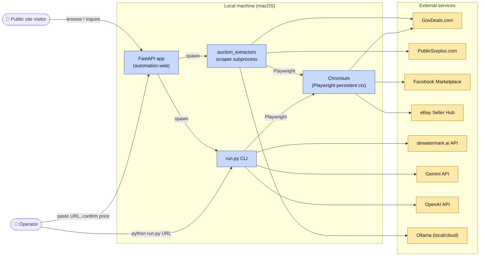
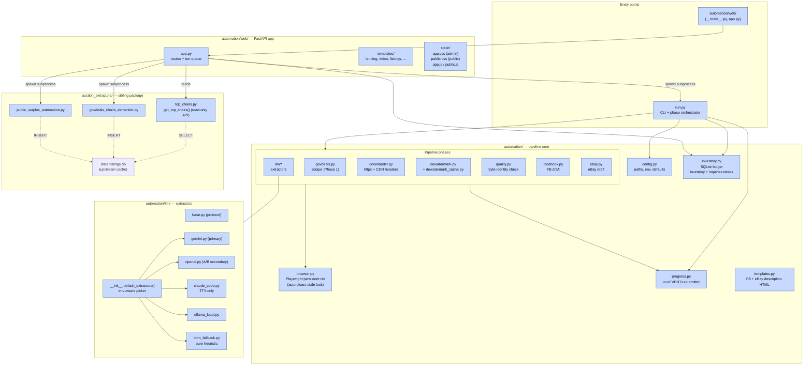
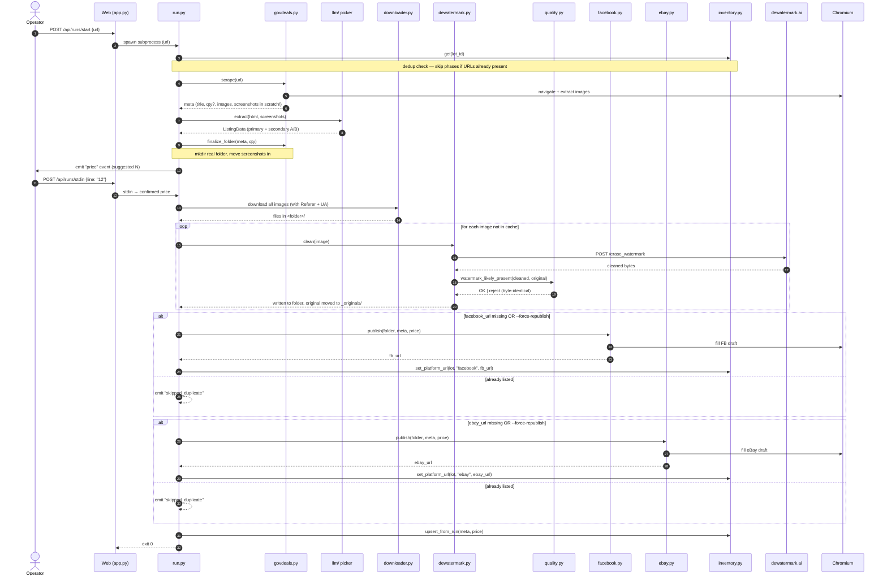
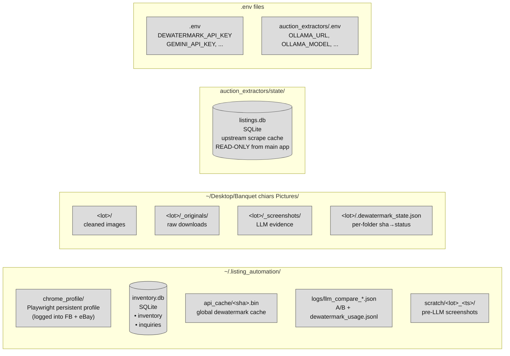
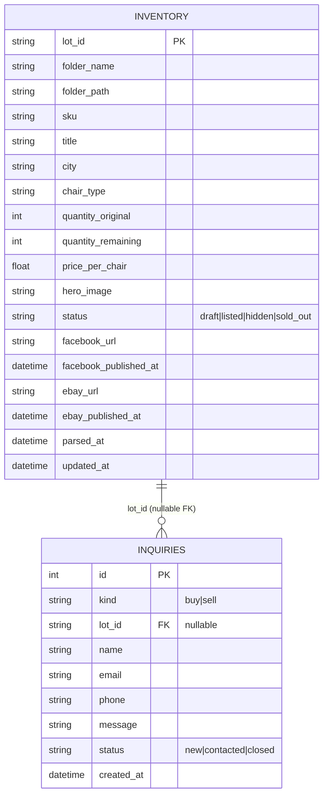

# Listing Automation — Architecture (as of 2026-04-21)

This document is a **living map** of the system as it exists today, derived from
`CLAUDE.md` + the current repo layout. It is meant to be edited directly:

- Every diagram is Mermaid → edit the text, the picture follows.
- Leave comments in `<!-- COMMENT: ... -->` blocks next to the thing you're
  critiquing. GitHub/VS Code both render these as hidden in the preview but
  visible in raw edit mode.
- The "Rebuild notes" section at the bottom is where to stage proposed
  changes before they touch code.

Legend used throughout:

- **Solid arrow** = runtime call / HTTP / subprocess spawn
- **Dashed arrow** = read/write to persistent state
- **Blue fill** = our code
- **Yellow fill** = external service
- **Gray fill** = local persistent storage

---

## 1. System context — who talks to whom



<!-- COMMENT:
     - Anything missing from this view?
     - Should the scraper really share a browser profile with the pipeline?
-->

---

## 2. Module/package layout — what's in the repo



<!-- COMMENT:
     - Is the top-level split (entry / core / llm / web / auction_extractors)
       the right cleave? If rebuilding from scratch, what would you pull out
       into its own package vs. inline?
     - run.py is doing a LOT (CLI parsing + orchestration + ledger consults
       + price-confirm UX). Candidate for splitting.
-->

---

## 3. Pipeline flow — one URL → two drafts

This is the happy path through `run.py`. Each phase emits `<<<EVENT>>>` lines
consumed by the dashboard.



<!-- COMMENT:
     - Price confirmation is synchronous & blocking. Worth keeping?
     - The dedup check happens per-phase — would a single up-front "what needs
       doing" resolver be cleaner?
     - No retry logic anywhere. FB/eBay failures currently just degrade.
-->

---

## 4. Persistence layout — where state lives



Two tables inside `inventory.db`:



<!-- COMMENT:
     - 4 different places state lives (~/.listing_automation, ~/Desktop/...,
       auction_extractors/state, .env files). Consolidate?
     - listings.db is explicitly read-only from the main app. If rebuilding,
       does that separation still make sense, or should there be one DB?
-->

---

## 5. Web surfaces — one FastAPI process, two audiences

```mermaid
flowchart TB
    subgraph fastapi["FastAPI process (python -m automation.web, :8765)"]
        direction TB

        subgraph public["Public site (brutalist-industrial theme)"]
            p_root["GET /<br/>landing.html<br/>live stats + featured strip"]
            p_list["GET /listings<br/>card grid + client-side filters"]
            p_detail["GET /listings/{lot_id}<br/>gallery + spec + inquiry form"]
            p_sell["GET /sell<br/>seller intake form"]
            p_contact["POST /contact<br/>→ inquiries table"]
        end

        subgraph admin["Admin dashboard (/admin, dark terminal theme)"]
            a_root["GET /admin<br/>index.html (tabs)"]
            t1["01 Launcher<br/>URL input + UP NEXT queue"]
            t2["02 Drafts<br/>live pipeline log"]
            t3["03 A/B<br/>LLM compare + dewatermark usage (TODO)"]
            t4["04 Auctions<br/>auction_extractors cards<br/>+ scrape button + staleness banner"]
            t5["05 Inventory<br/>editable table"]
            t6["06 Inquiries<br/>chronological cards"]
        end

        subgraph api["Admin JSON APIs"]
            api_inv["/api/inventory<br/>/api/inventory-stats<br/>/api/inventory/backfill<br/>/api/inventory/{lot_id}/platform"]
            api_inq["/api/inquiries (list/patch/delete)"]
            api_runs["/api/runs/start (legacy)<br/>/api/runs/queue<br/>/api/runs/queue/clear<br/>/api/runs/stdin"]
            api_auc["/api/auctions (cached 10min)<br/>/api/auctions/refresh<br/>/api/auctions/cache-stats<br/>/api/auctions/scrape"]
            api_media["/image/*  /screenshot/*  /static/*"]
        end
    end

    p_root -.reads.-> inv_db2[("inventory.db")]
    p_list -.reads.-> inv_db2
    p_detail -.reads.-> inv_db2
    p_contact -.writes.-> inv_db2

    t5 <-->|CRUD| api_inv
    t6 <-->|CRUD| api_inq
    t1 -->|POST| api_runs
    t4 <-->|GET/POST| api_auc

    api_runs -->|spawn serially| runpy["run.py subprocess"]
    api_auc -->|spawn| gd_scrape2["govdeals scraper subprocess"]
    api_auc -->|spawn| ps_scrape2["public_surplus scraper subprocess"]

    api_inv -.->|SQL| inv_db2
    api_inq -.->|SQL| inv_db2
    api_auc -.->|read-only SELECT| listings_db2[("listings.db")]

    classDef ours fill:#c7d9ff,stroke:#2b4b99,color:#111
    classDef storage fill:#dcdcdc,stroke:#555,color:#111
    class p_root,p_list,p_detail,p_sell,p_contact,a_root,t1,t2,t3,t4,t5,t6,api_inv,api_inq,api_runs,api_auc,api_media,runpy,gd_scrape2,ps_scrape2 ours
    class inv_db2,listings_db2 storage
```



<!-- COMMENT:
     - Public + admin in one process — keep for simplicity, or split for
       deploy-ability?
     - The run queue lives in process memory (state.pending). Restart =
       lose the queue. Worth persisting?
-->

---

## 6. Observability / events

```
run.py emits:      <<<EVENT>>>{"phase": "...", "status": "...", ...}\n
dashboard parses:  automation/web/app.py tails subprocess stdout line-by-line
storage:           ~/.listing_automation/logs/
                     - llm_compare_*.json   (per-run A/B log)
                     - dewatermark_usage.jsonl  (API call log)
```

<!-- COMMENT:
     - No structured log aggregation. Fine for single-user. Would need work
       before multi-tenant.
-->

---

## 7. Rebuild notes — staging ground for v2

This section is where to draft proposed changes *before* they become code.
Keep them short; each one should map to an eventual commit or PR.

### 7.1 Known rough edges (from CLAUDE.md "TODOs" + Gotchas)

| # | Pain | Where it lives today |
|---|------|----------------------|
| 1 | eBay flow doesn't land on a real draft URL | `automation/ebay.py` selectors |
| 2 | FB + eBay selectors are best-effort, print `[fallback]` warnings | `automation/facebook.py`, `automation/ebay.py` |
| 3 | GovDeals quantity regex `\((\d{1,5})\)` is brittle | `automation/govdeals.py` `EXTRACT_JS` |
| 4 | No cost-tracking tile on dashboard | `automation/web/templates/index.html` 03 A/B tab |
| 5 | Price confirm is synchronous, blocks the pipeline | `run.py` price-confirm loop |
| 6 | Run queue is in-memory only | `automation/web/app.py` `state.pending` |
| 7 | Desktop location blocks launchd/cron for auto-scrape | moving the repo fixes it |
| 8 | `run.py` carries too many responsibilities | CLI + orchestrator + UX + ledger |

### 7.2 Architectural bets to decide on

<!-- COMMENT: Edit these freely. One-liners, not essays. -->

- [ ] **Single DB vs. two DBs.** Merge `listings.db` into `inventory.db`
      with a clear "upstream_cache" table, or keep the read-only wall?
- [ ] **Split `run.py`.** Candidates: `orchestrator.py` (phase runner),
      `cli.py` (argparse), `price_prompt.py` (TTY/dashboard bridge).
- [ ] **Phase abstraction.** Today each phase is a bespoke module.
      A `Phase` protocol (`name`, `should_run(ctx)`, `run(ctx)`, `record(ctx)`)
      would make dedup + retry + progress uniform.
- [ ] **Retry/resume.** FB or eBay fails → currently no way to resume
      just that phase. Ledger has enough info to make this possible.
- [ ] **Config surface.** `.env` + `automation/config.py` + two separate
      `.env` files (root + `auction_extractors/`) is fragmented. One
      settings model (pydantic-settings) that loads both?
- [ ] **Queue persistence.** Write `state.pending` to disk so dashboard
      restart doesn't lose the backlog.
- [ ] **Public site split.** Does the customer-facing site want to be its
      own process (or even static export) so admin-only deploys don't
      restart the public surface?
- [ ] **Platform abstraction.** Shared interface for FB/eBay (and future
      Craigslist/OfferUp) — `Publisher.publish(folder, meta) -> url`.

### 7.3 Scope of "v2"

<!-- COMMENT: Cut or expand. The point of this file is to argue about scope. -->

- **In scope:** anything that makes the pipeline more resumable, more
  observable, or cheaper to extend with new platforms.
- **Out of scope (for now):** multi-user, auth, cloud deploy, non-macOS.

---

## 8. How to update this file

- Edit Mermaid text directly. VS Code's "Markdown Preview Mermaid Support"
  extension renders live.
- Keep the five views (context / modules / flow / storage / web) as the
  top-level structure even if individual boxes change.
- When a rebuild decision from §7.2 actually lands, move it to a brief
  "Done" line at the top of §7 with a date, and update the diagrams.
- If a diagram gets too busy to edit comfortably, split it rather than
  shrinking nodes.
